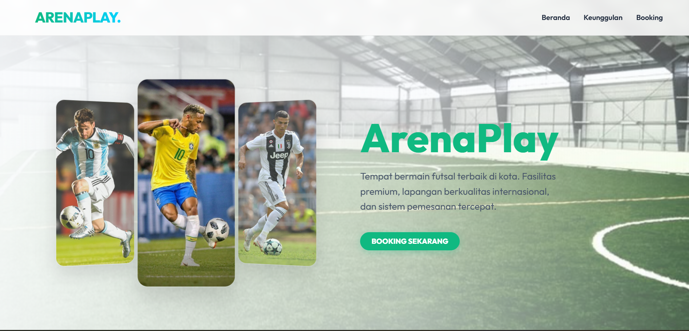
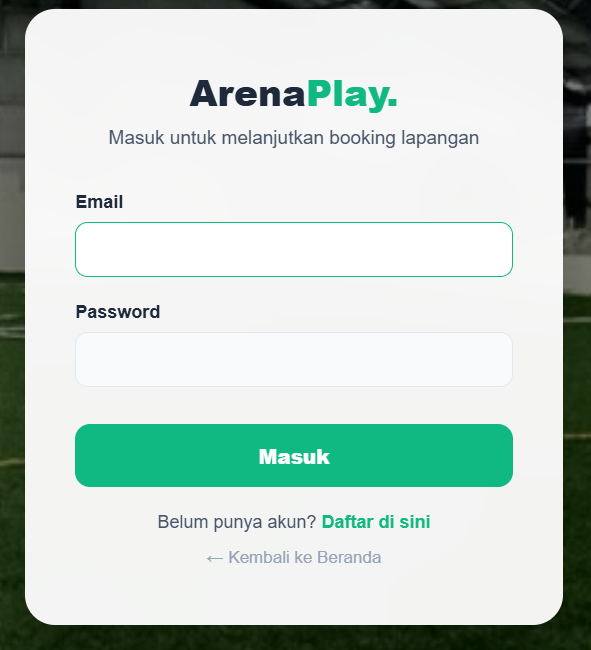
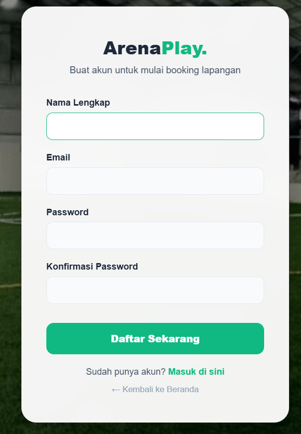
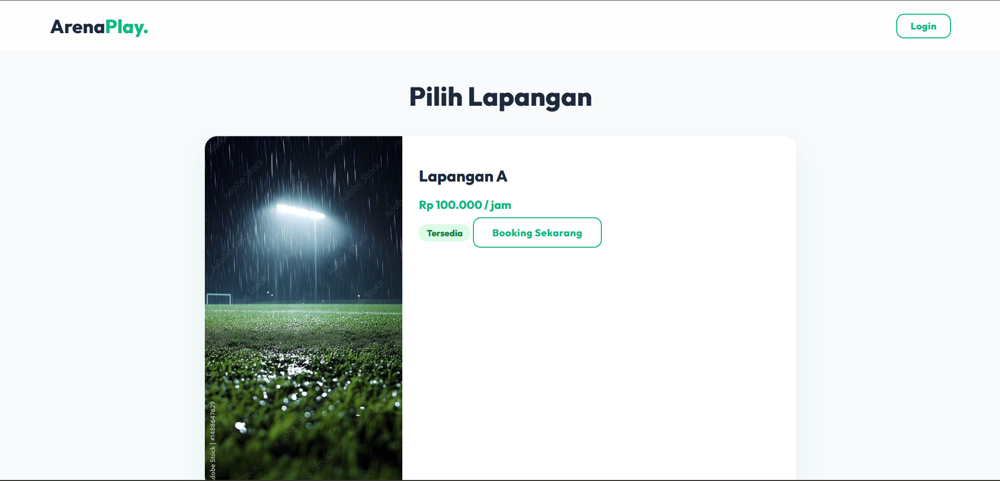
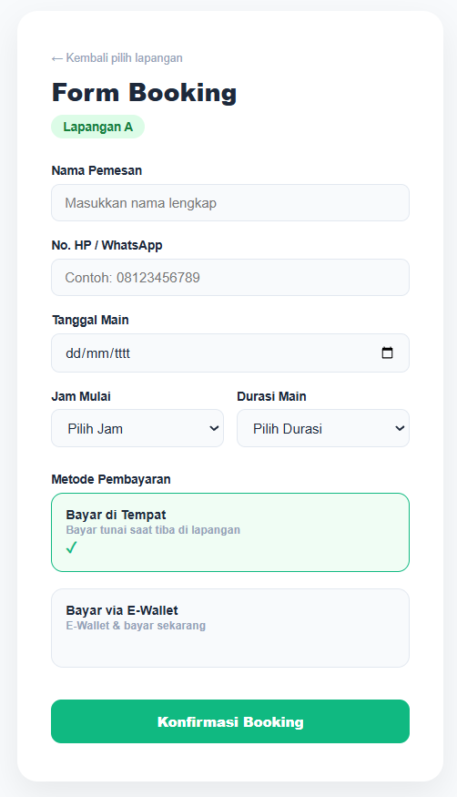
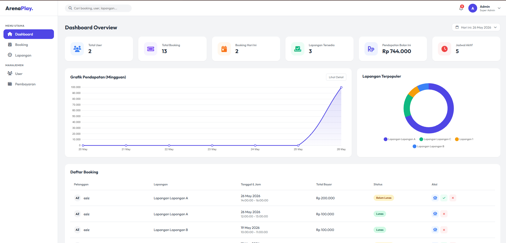
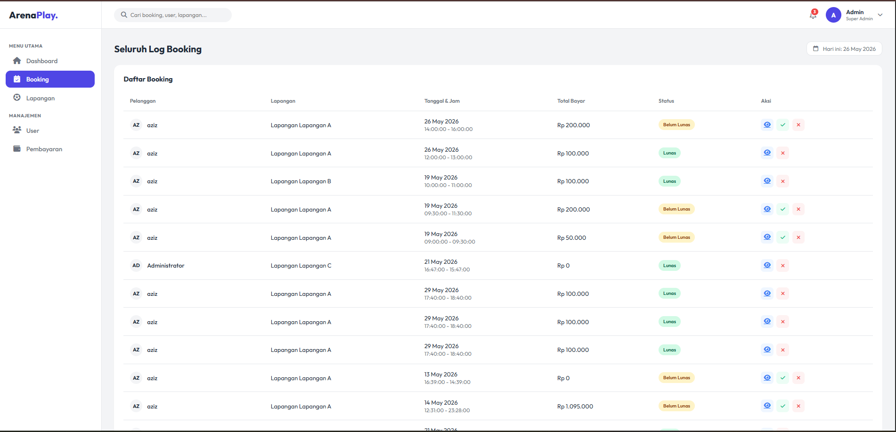
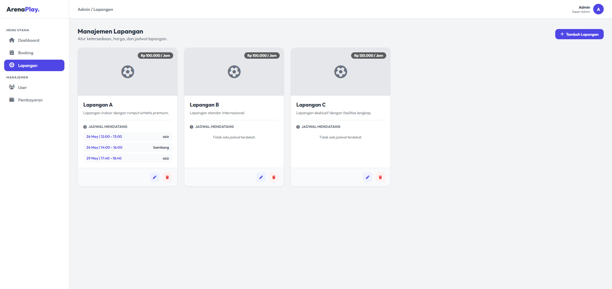
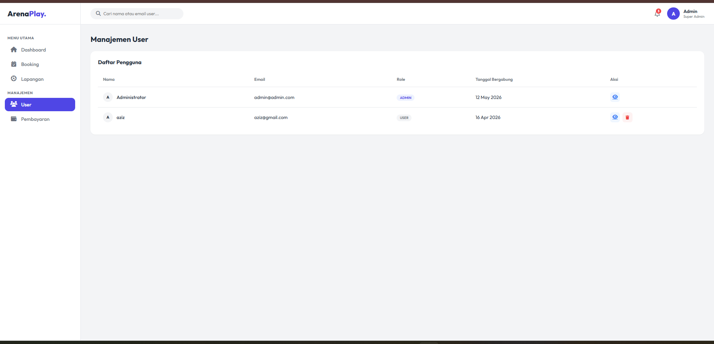
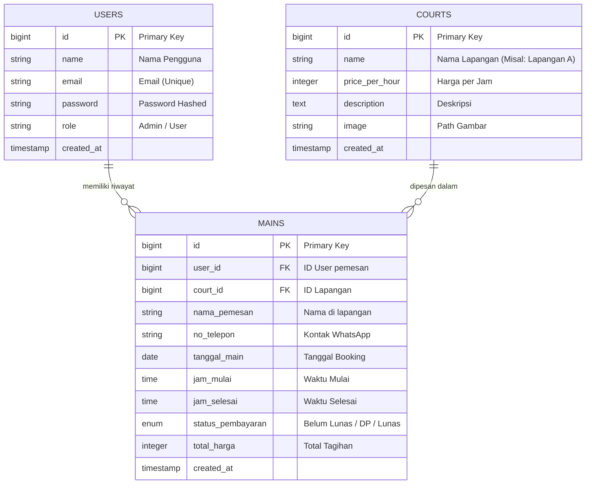

# ArenaPlay - Aplikasi Booking Lapangan Futsal 🏟️⚽


## 📖 Deskripsi
ArenaPlay adalah platform aplikasi web berbasis Laravel yang dirancang untuk memudahkan proses pemesanan (booking) lapangan futsal. Sistem ini menyediakan antarmuka yang ramah pengguna bagi pelanggan untuk melihat ketersediaan lapangan dan melakukan pemesanan, serta menyediakan dashboard komprehensif bagi admin untuk mengelola seluruh operasional lapangan futsal.

---

## ✨ Detail Fitur dan Tampilan Aplikasi

### 1. Landing Page / Welcome



**Headline:**  
ArenaPlay

**Subheadline:**  
Tempat bermain futsal terbaik di kota. Fasilitas premium, lapangan berkualitas, dan sistem pemesanan yang cepat.

**CTA:**  
Booking Sekarang

**Section Keunggulan:**  
Mengapa memilih ArenaPlay sebagai tempat bermain futsal Anda?

- **Card 1: Tidak Terpengaruh Cuaca**  
  Main futsal kapan saja, tanpa khawatir hujan atau panas. Lapangan indoor kami selalu nyaman untuk bermain.
- **Card 2: Pencahayaan Optimal**  
  Tetap terang siang maupun malam.
- **Card 3: Cocok untuk Event**  
  Tempat yang sempurna untuk mengadakan turnamen futsal, acara perusahaan, atau pertandingan persahabatan.

**Call to action bawah:**  
Booking lapangan futsal sekarang juga dan nikmati fasilitas terbaik di kota.

---

### 2. Halaman Login



**Subtitle:**  
Masuk untuk melanjutkan booking lapangan

**CTA:**  
Masuk

**Footer:**  
Belum punya akun? Daftar di sini

**Kembali:**  
← Kembali ke Beranda

---

### 3. Halaman Register



**Subtitle:**  
Buat akun untuk mulai booking lapangan

**CTA:**  
Daftar Sekarang

**Footer:**  
Sudah punya akun? Masuk di sini

**Kembali:**  
← Kembali ke Beranda

---

### 4. Dashboard Pengguna / Dashboard Biasa



**Heading utama:**  
Pilih Lapangan

**CTA card:**  
Booking Sekarang

**State kosong:**  
Maaf, belum ada lapangan yang tersedia saat ini.

**Nav bar:**  
Halo, [nama pengguna]

**Button logout:**  
Logout

---

### 5. Form Booking



**Heading utama:**  
Form Booking

**Back link:**  
← Kembali pilih lapangan

**Field placeholder:**  
Masukkan nama lengkap

**Label utama:**  
- Nama Pemesan  
- No. HP / WhatsApp  
- Tanggal Main  
- Jam Mulai  
- Durasi Main  
- Metode Pembayaran  
- Estimasi Total

**Payment options:**  
- **Bayar di Tempat:** Bayar tunai saat tiba di lapangan  
- **Bayar via E-Wallet:** E-Wallet & bayar sekarang  

**CTA:**  
Konfirmasi Booking

**Error / alert:**  
Informasi konflik jadwal bisa ditampilkan di sini jika booking tidak tersedia.

---

### 6. Dashboard Admin



**Title:**  
Dashboard Overview

**Header tanggal:**  
Hari ini: [tanggal]

**Stat cards:**  
- Total User  
- Total Booking  
- Booking Hari Hari Ini  
- Lapangan Tersedia  
- Pendapatan Bulan Ini  
- Jadwal Aktif

**Chart titles:**  
- Grafik Pendapatan (Mingguan)  
- Lapangan Terpopuler

**Button:**  
Lihat Detail

**Table heading:**  
Daftar Booking

**Badge status:**  
- Lunas  
- Belum Lunas

**Sidebar menu:**  
- Dashboard  
- Booking  
- Lapangan  
- User  
- Pembayaran

---

### 7. Halaman Admin Booking



**Title:**  
Seluruh Log Booking

**Search placeholder:**  
Cari booking, user, lapangan...

**Header tanggal:**  
Hari ini: [tanggal]

**Heading table:**  
Daftar Booking

**Kolom tabel:**  
- Pelanggan  
- Lapangan  
- Tanggal & Jam  
- Total Bayar  
- Status  
- Aksi

**Status:**  
- Lunas  
- Belum Lunas

**Action tombol:**  
- Detail  
- Verifikasi Lunas  
- Batalkan/Hapus

**State kosong:**  
Belum ada data booking.

---

### 8. Halaman Admin Lapangan



**Title:**  
Manajemen Lapangan

**Heading:**  
Daftar Lapangan

**CTA:**  
Tambah Lapangan

**Deskripsi card lapangan:**  
- Deskripsi lapangan  
- Harga per jam  
- Jadwal / informasi tambahan

**Section schedule:**  
Jadwal Lapangan

**Action tombol:**  
- Edit  
- Hapus

**Modal / form:**  
- Nama Lapangan  
- Deskripsi  
- Harga per jam  
- Upload gambar

---

### 9. Halaman Admin User



**Title:**  
Manajemen User

**Search placeholder:**  
Cari nama atau email user...

**Heading table:**  
Daftar Pengguna

**Kolom tabel:**  
- Nama  
- Email  
- Role  
- Tanggal Bergabung  
- Aksi

**Role badge:**  
- admin  
- user

**State kosong:**  
Tidak ada user ditemukan.

**Action tombol:**  
- Detail  
- Hapus User

---

---

## 🗄️ Struktur Database (ERD)

Aplikasi ini menggunakan skema database relasional yang sederhana namun efektif untuk mengelola pemesanan lapangan. Berikut adalah visualisasi **Entity-Relationship Diagram (ERD)** dari database ArenaPlay:



### Penjelasan Tabel:

1. **Tabel `users` (Pengguna & Admin)**  
   Tabel ini menyimpan data seluruh akun yang terdaftar di aplikasi. Terdapat kolom `role` yang berfungsi untuk membedakan antara hak akses **admin** dan **user biasa**.
2. **Tabel `courts` (Data Lapangan)**  
   Menyimpan seluruh katalog atau daftar lapangan futsal yang tersedia di ArenaPlay. Informasi harga per jam (`price_per_hour`) diatur dari tabel ini sehingga memudahkan admin jika ingin menaikkan atau menurunkan tarif lapangan.
3. **Tabel `mains` (Transaksi Booking)**  
   Ini merupakan tabel utama (transaksional) yang menghubungkan antara *User* dan *Court*. Tabel ini mencatat secara detail kapan lapangan dipesan (`tanggal_main`, `jam_mulai`, `jam_selesai`), data kontak pemesan, serta merekap jumlah tagihan (`total_harga`) dan status pembayarannya.

---

## ⚙️ Cara Instalasi (Local Development)

Ikuti langkah-langkah berikut untuk menjalankan aplikasi ini di komputer lokal Anda:

1. **Clone repositori** atau ekstrak source code.
2. Buka terminal/command prompt di direktori project:
   ```bash
   cd booking-app
   ```
3. Install dependencies menggunakan Composer:
   ```bash
   composer install
   ```
4. Copy file konfigurasi environment:
   ```bash
   cp .env.example .env
   ```
5. Sesuaikan konfigurasi database di file `.env`:
   ```env
   DB_CONNECTION=mysql
   DB_HOST=127.0.0.1
   DB_PORT=3306
   DB_DATABASE=nama_database_anda
   DB_USERNAME=root
   DB_PASSWORD=
   ```
6. Generate application key:
   ```bash
   php artisan key:generate
   ```
7. Jalankan migrasi database dan seeder (untuk data awal):
   ```bash
   php artisan migrate --seed
   ```
8. Jalankan server lokal:
   ```bash
   php artisan serve
   ```
9. Buka browser dan akses `http://localhost:8000`.

---

